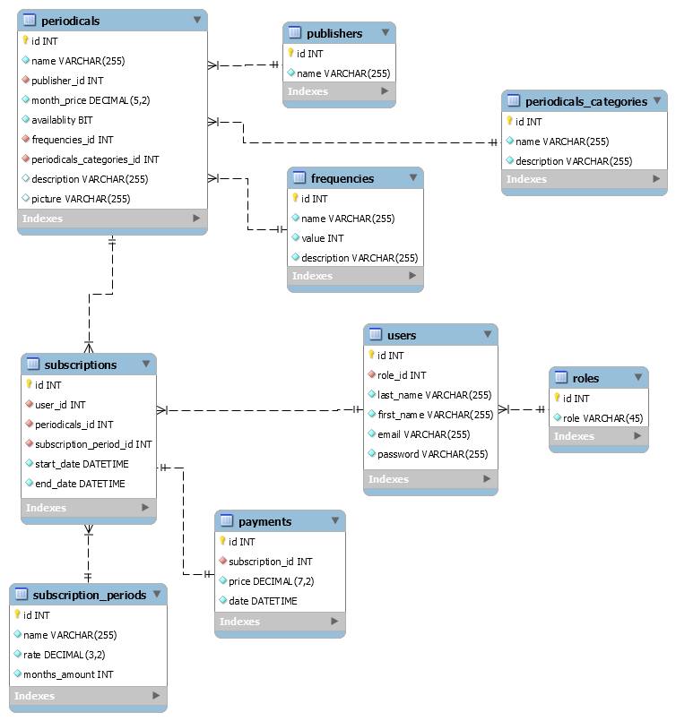

# Periodicals

### ОПИСАНИЕ ПРОЕКТА:

**12. Система Периодические издания.**

**Администратор** осуществляет ведение каталога **периодических Изданий**.
**Читатель** может оформить **Подписку**, предварительно выбрав **периодические
Издания** из списка. Система подсчитывает сумму для оплаты и регистрирует **Платеж**.

### Общие требования:
- [x] На основе сущностей предметной области создать классы их описывающие.
- [x] Классы и методы должны иметь отражающую их функциональность названия и должны быть грамотно структурированы по пакетам.
- [x] Информацию о предметной области хранить в БД. В качестве СУБД рекомендуется MySQL.
- [x] Приложение должно поддерживать работу с кириллицей (быть многоязычной), в том числе и при хранении информации в БД.
- [x] Код должен быть документирован.
- [x] Приложение должно быть покрыто Юнит-тестами.
- [x] Cобытия в системе обрабатывать с помощью Log4j.
- [x] В приложении необходимо реализовать Pagination, Transaction в зависимости от Вашего проекта.
- [x] Приложение должно корректно реагировать на ошибки и исключения разного рода (Пользователь никогда не должен видеть stack-trace на стороне front-end).
- [x] В приложении должна быть реализована система Авторизации и Аутентификации.

### Читатель (пользователь) может:
- [x] Просматривать каталог периодических изданий.
- [x] Зарегистрироваться в системе подписки на периодические издания.
- [x] Добавлять периодические издания в корзину, удалять их из корзины.
- [x] Оформлять подписку на издания в корзине посредством осуществления платежа.
 Для осуществления подписки читатель должен осуществить вход в систему.
- [x] Просматривать текущие и истекшие подписки.

### Администратор может:
- [x] Просматривать каталог периодических изданий.
- [x] Добавлять в систему, редактировать периодические издания.
- [x] Добавлять в систему издателей.
- [x] Делать периодические издания недоступными для подписки.
- [x] Просматривать перечень осуществленных платежей.
- [x] Просматривать профили пользователей.

### ER МОДЕЛЬ ПРОЕКТА:
